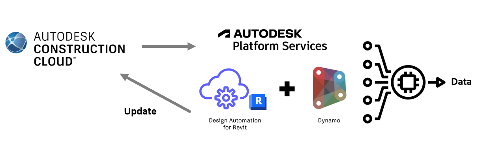
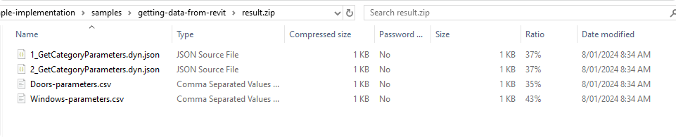

  [](https://opensource.org/licenses/MIT)

   

[](http://hits.dwyl.com/chuongmep/da-dynamorevit)
<a href="https://twitter.com/intent/follow?screen_name=chuongmep">
</a>

### Description

Make Dynamo Revit Possible Execute Task Design Automation for Revit In Autodesk Construction Cloud (ACC)



### Prerequisites

To run Dynamo graphs in the cloud, it is necessary to have a basic understanding on how Autodesk Design Automation works. Please check out the [documentation for Design Automation](https://aps.autodesk.com/en/docs/design-automation/v3/developers_guide/overview/) for get an overview ([alternative guide](https://aps.autodesk.com/en/docs/design-automation/v3/tutorials/revit/)). If you are new to this we recommend starting with the [step-by-step tutorials](https://aps.autodesk.com/en/docs/design-automation/v3/tutorials/revit/about_this_tutorial/). Take a look here for a [quick-start guide](https://github.com/autodesk-platform-services/aps-tutorial-postman/tree/master/DA4Revit).


### Making your own Revit Design Automation Dynamo Implementation

To run Dynamo graphs on your Revit model in Design Automation you need to reference *RDADHelper.dll* in your DB app. RDADHelper stands for *Revit Design Automation Dynamo Helper* and works as an intermediate layer between your DB app bundle and Dynamo. Refer to the files included in this implementation on the specifics.

#### Setting Environment Variables:

```bash
set APS_CLIENT_ID=<your client id>
set APS_CLIENT_SECRET=<your client secret>
```

#### The APS work item for this implementation looks similar to the below:

```csharp
string bundlePath =
            @"<Bundle Path Zip(D4DA.bundle.zip)>";
        string inputZipPath =
            @"<Input Zip Path(Input.Zip)>";
        DesignAutomateConfiguration configuration = new DesignAutomateConfiguration()
        {
            AppName = "TestDynamoRevitDA",
            NickName = "<nick name created in design automation app>",
            Version = DA_DynamoRevit.Version.v2024,
            Engine = Engine.Revit,
            Alias = Alias.DEV,
            ActivityName = "TestDynamoRevitDAActivity",
            ActivityDescription = "TestDynamo Revit Design Automation",
            PackageZipPath = bundlePath,
            BundleDescription = "TestDynamo Revit Design Automation",
            ResultFileName = "result",
            ResultFileExt = ".zip"
        };
        DynamoRevitDesignAutomate dynamoRevitDesignAutomate = new DynamoRevitDesignAutomate(configuration);
        string forgeToken2Leg =
            await Authentication.Get2LeggedToken(configuration.ClientId, configuration.ClientSecret);
        Scope[] scope = new Scope[]
            { Scope.DataRead, Scope.DataWrite, Scope.DataCreate, Scope.BucketRead, Scope.BucketCreate, Scope.CodeAll };
        Status executeJob =
            await dynamoRevitDesignAutomate.ExecuteJob(forgeToken2Leg, projectId, versionId,
                inputZipPath);
        Console.WriteLine(executeJob);
```

Tip : To know more about example, please check [DADynamoRevitTest](./src/DA_UnitTest/DADynamoRevitTest.cs)

The activity expects a signed download link to a Revit file (either uploaded to the OSS storage or from Bim360), that will be downloaded and opened in Revit by Design Automation. The second input is a signed download link to a zip that will include the dynamo graph(s) and all of the supporting files.

The current implementation expects an `input.json` file that contains a list of RDADHelper `RunGraphArgs`. Each `RunGraphArgs` item in the list has the following properties:
- **GraphName**: The name of the Dynamo graph to run inside the zip file.
- **InputFolder**: the local name of the input zip as defined in your APS activity. You have to remember that RDADynamo does not have any knowledge of your implementation specifics and needs this property to find the dynamo graph.
- **ResultFolder**: this is an optional input that is recommended. If you specify a result folder, RDADynamo will move your graph there before executing it. That way all files saved by the graph will be placed in that result folder and it can later be returned by APS as a single link to a zip, instead of multiple ones for each file. If you do not want to use this feature, you have to make sure that you handle the created files manually.
- **InputFileNames**: if your graph has any file input nodes, Dynamo will look for the file relative to the folder of the graph. If you've specified a 'ResultFolder', you will need to list these files here, so that RDADynamo can also move them over to the result folder prior to executing the graph. That way you can simplify your input paths inside your graph.
- **Packages**: list of folders where Dynamo should look for custom packages. An easy way to implement this is to put all of your custom packages in a single reference folder. Alternatively, you can provide each folder separately.
- **NodeInput**: a list of `NodeValues` to modify the graph nodes with. Only valid input nodes can be modified. In Dynamo, input nodes have an "Is Input" attribute in the right-click menu. 'Number' node or 'String' node are examples of input nodes. 'Add' node or 'Python Script' node are examples of nodes that cannot be modified. Each `NodeValue` has the following properties:
  - **Id**: the unique identifier of the node. This can be found in the Dynamo graph file. You can open the graph file in a text editor and search for the node name to find the Id.
  - **Name**: The name of the node property to modify. _Important_: This is not the name of the node, and it's not name of output. Usually it should just be `Value`. Please open the graph in a text editor to find the name of the property. 
  - **Value**: the value to set the input parameter to. This can be a string or a number.

> 💡**Hint**: Set your input nodes in your graph to `Is Input` by right clicking on them. The input nodes will then appear under `Inputs` when you open the graph in a text editor, so you can easily find them.

The input.json in this case could look something like this:
```json
[
    {
        "GraphName": "graphA.dyn",
        "InputFolder": "input.zip",
        "ResultFolder": "result",
        "InputFileNames": [
            "some_graph_input_file.csv"
        ],
        "Packages": [
            "packages"
        ],
        "NodeInput": [
            {
                "Id": "0c302edfd35c494d823990676f5f4aa0",
                "Name": "Value",
                "Value": "42"
            },
            {
                "Id": "a1b2c3d4123456789abcdef012345678",
                "Name": "Value",
                "Value": "Hello World"
            }
        ]
    },
    {
        "GraphName": "graphB.dyn",
        "InputFolder": "input.zip",
        "ResultFolder": "result",
        "InputFileNames": [
        ],
        "Packages": [
            "packages"
        ],
        "NodeInput": [
            {
              "Id": "0c302edfd35c494d823990676f5f4aa0",
              "Name": "Value",
              "Value": "42"
            }
        ]
    }
]
```

Based on that, your input.zip file would need to have a folder structure similar to this:

### input.zip:
- input.json
- packages:
  - package A folder
  - package B folder
- graphA.dyn
- graphB.dyn
- some_graph_input_file.csv
- python-3.9.12-embed-amd64.zip (for when you need to run cPython scripts)

## Using Custom Packages

**Custom packages**

- Custom packages must be included in a folder inside your work item’s input.
- Your graph’s `RunArguments` will need to add that folder to its list of `Packages`.

**CPython script nodes**

- If you need to use cPython, you can optionally provide a zipped distribution of cPython inside your work item’s input.
- It must be version 3.9
- It must be called “python-3.9.12-embed-amd64.zip”
- It must include any custom python modules that your scripts need

**IronPython**

- If your graph has any iron python scripts or uses any custom nodes that need iron python to work, then will you need to add the `Dynamo.IronPythonX.X` package in one of your packages folder (see note about custom packages above)
- The version of iron python will depend on the included packages’ dependency. Most packages need `Dynamo.IronPython2.7`. For example, Clockwork and Spring Nodes need `Dynamo.IronPython2.7` to function.

## Setting Custom Node Values

1. To set a value of an input node, you need to get this information about the node:
    
    
    | Guid | The unique identifier of the node |
    | --- | --- |
    | Name | The name of the property that you would like to change (usually Value) |
    | Value | The new value you want the node to have |
2. This information is located in the .dyn file of your Dynamo graph.
3. All input nodes are stored at the top of the *.dyn file in the “Inputs” list. We reccomend you use a json compattible notepad application like Notepad++ or VSCode for easy access. Open the *.dyn graph in the editor of your choice.
4. Add the new values inside your `input.json` file as a list under the `NodeInput` property.

## Graph Execution, Feedback and Troubleshooting

After running a graph, the `OnGraphResultReady` action will return an object of type `GraphResultArgs`. Use this object to troubleshoot your graphs. We recommend you serialize this object with Newtonsoft.Json, or similar, and write its content to an output file in your `ResultFolder`.

- `MissingNodes` will include any zero touch nodes that could not be found.
- `WarningNodes` will include any *.dyf nodes that could not be found or any node that produced a warning or an error during the graph’s execution.
- `OutputNodes` will include the value of any Watch Node that was marked as Output, similar to Dynamo Player. Using output watch nodes in key places inside your graph is another way in which you could troubleshoot its execution.

## Sample Inputs

- [Run Graph To Export Data By Category (Door-Windows)](https://github.com/tothom/RDADynamo-example-implementation/tree/main/samples/getting-data-from-revit)

Output : 



Doors : 

|ID    |Area              |Category|Comments|Design Option|Edited by|Export to IFC|Export to IFC As|Family   |Family and Type|Family Name|Finish|Frame Material|Frame Type|Head Height|Host Id     |IFC Predefined Type|IfcGUID               |Image|Level  |Mark|Phase Created     |Phase Demolished|Sill Height|Type     |Type Id  |Type Name|Volume            |Workset|
|------|------------------|--------|--------|-------------|---------|-------------|----------------|---------|---------------|-----------|------|--------------|----------|-----------|------------|-------------------|----------------------|-----|-------|----|------------------|----------------|-----------|---------|---------|---------|------------------|-------|
|291310|3.1935419999999777|Doors   |        |-1           |         |0            |                |36" x 84"|36" x 84"      |           |      |              |          |2133.6     |Generic - 6"|                   |1Ri6dAvFvEOxun_An4x7pU|     |Level 1|1   |Project Completion|None            |0.0        |36" x 84"|36" x 84"|         |0.1197566637119994|0      |

Recheck data model example online : https://forge.chuongmep.com/

## Current _[Limitations]()_
Please refer to the [list of limitations](https://github.com/tothom/RDADynamo-example-implementation/blob/main/docs/UnsupportedNodes.md) for more info and suggested workaround.

## Building RDA Dynamo
Please refer to the [following steps](https://github.com/tothom/RDADynamo-example-implementation/blob/main/docs/Develop.md) to build and develop RDADynamo further.

## Copyright

This source upgraded from [RDADynamo-example-implementation](https://github.com/tothom/RDADynamo-example-implementation)
